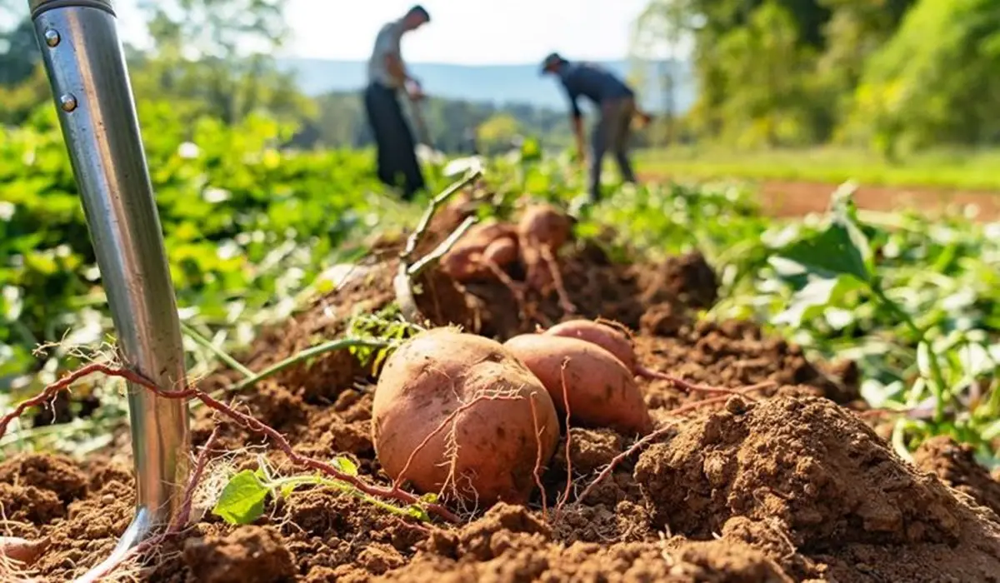

Hello friends, this is my new end-to-end deep learning project in the agriculture domain.
Every year, farmers suffer economic losses and crop waste as a result of various potato plant diseases. We will use image classification using CNN and build a model and a website using which a farmer can take a picture, and the model will tell you if the plant has a disease or not.

This data science project walks through step by step process of how to build a Patato Disease Classification website. We will first build a model using CNN using Potato Leaf dataset from kaggle.com. Second step would be to write a python flask server that uses the saved model to serve http requests. Third component is the website built in html, css and javascript that allows user to drop an image and it will call python flask server to retrieve the predicted potato disease. During model building we will cover almost all data science concepts such as data collection, data load and cleaning, deep learning, CNN. Technology and tools wise this project covers,

1. Python
2. Numpy and Pandas for data cleaning
3. Matplotlib for data visualization
4. CNN for model building
5. Jupyter notebook, visual studio code and pycharm as IDE
6. Python flask for http server
7. HTML/CSS/Javascript for UI
